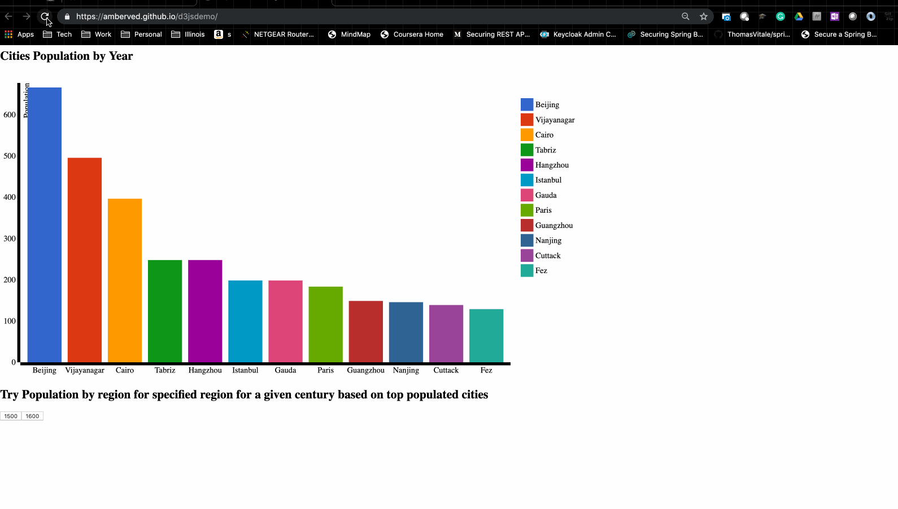

# Visualization & exploration of change in population across large cities in different geographies of the world from the year 1500 to the year 2019
 
The page is designed into 2 different logical sections. These 2 sections of the page not only present data thru different visualization or allowing users to interact with data differently but only present information in different format.The visualization achieved in this page is based on various capacities of d3.js. I am using v3 of D3.js for now.
 
Section 1 of the page is a more narrative visualization, where the user is showing changes in populations of the various cities across different time from 1500 to 2019s. The cities are arranged by population size and color representing them is kept the same across different years for better visualization when the rank of cities changes based on its population. In this part, the user can sit back and visually see how things have changed over time for an overall feel. If the user chooses to interact, he also has the option to stop/pause the graphic/visualization by moving the mouse on top of the graph. This allows the user time to review the details of any given year. He also has the option to move back and forth in the time using left and right-click. Finally, to start the auto visualization he just has to move the mouse away from the graph area. It is also worth noting that the scale of the bar chart also changes based on the maximum population of the cities for a given year.
 
Section 2 allows the user to inspect data more based on the manual control based on his selection the summary of the population across different geographical areas is showing using pie chart for better comparisons of the distributions.

 
Hope you enjoy the page and find visualization informative and fun.

 

